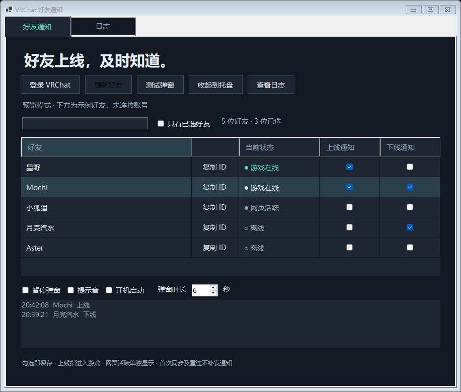
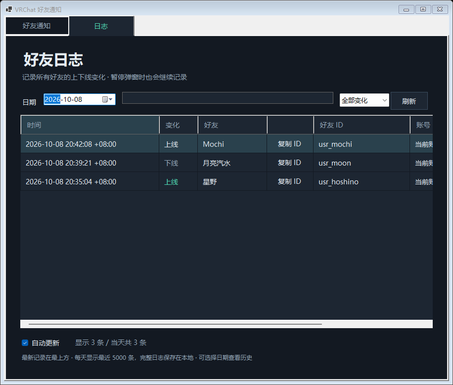

# VRC Friends Monitor

[](https://github.com/UyNewNas/vrc-friends-monitor/actions/workflows/ci.yml)
[](LICENSE)

Windows 上的 VRChat 好友状态监控工具。可为每位好友分别设置上线、下线通知，在桌面右下角显示小弹窗，并在程序内查看完整的本地日志。

## 功能

- 实时接收好友状态变化，支持断线自动重连。
- 每位好友独立的上线、下线通知开关；支持搜索和只看已选好友。
- 右下角弹窗不抢键盘焦点，支持暂停、提示音和显示时长设置。
- 关闭窗口后继续在托盘运行，可选择开机启动。
- 所有好友的游戏上线、下线变化静默记录到按日期保存的本地日志。
- 内置“日志”选项卡，支持历史日期、名称或 ID 搜索、状态筛选和自动更新。
- 好友列表和日志页均支持一键复制好友 ID。
- 支持 VRChat 账号登录、邮箱验证码、身份验证器和一次性恢复码；验证码错误时可重试。
- 支持浏览器登录：在独立的 Edge / Chrome 窗口中完成官网登录和两步验证，自动返回程序；加密保存登录会话。

以下截图使用离线模拟数据，不包含真实账号或好友信息：




## 下载与使用

从 [Releases](https://github.com/UyNewNas/vrc-friends-monitor/releases/latest) 下载 `VRC-Friends-Monitor-版本号-win-x64.zip`，解压后运行 `VRChatFriendNotifier.exe`。

支持 Windows 10 / 11 x64，无需单独安装 .NET。发布包未进行代码签名。

1. 使用 VRChat **用户名**和密码登录，用户名不是显示名称；也可点击“浏览器登录”，在打开的官方网页中登录。
2. 按提示完成两步验证。账号登录可选择身份验证器、邮箱验证码或恢复码；浏览器登录完成后自动连接，等待好友列表加载。
3. 为需要通知的好友勾选“上线通知”或“下线通知”。未勾选的好友仍会写入日志。
4. 切换到“日志”选项卡查看记录；点击名字旁的“复制 ID”复制对应好友 ID。
5. 关闭窗口会收起到托盘；右键托盘图标选择“退出程序”才会真正退出。

如果旧版本正在运行，请先从托盘退出，再启动新版。原有会话、通知设置和日志会沿用。开机启动用户更新程序位置后，需要重新关闭并开启该选项。

只有 Steam / Meta 登录的账号需要先绑定 VRChat 账号。详细操作见 [快速开始](docs/QUICKSTART.txt)。

浏览器登录需要已安装 Microsoft Edge 或 Google Chrome。程序创建独立的临时浏览器资料目录及隐私窗口，不读取日常浏览器的资料或已有登录。在官网完成登录后，只取 VRChat 的 `auth` 和 `twoFactorAuth` Cookie，并调用 API 确认认证完成；成功、取消或超时后关闭该浏览器实例并清理临时目录。等待时间上限为 10 分钟。此方式不是 OAuth 授权，也不会把网页密码或验证码传给本项目。

## 状态与限制

“上线”指进入 VRChat 游戏。网页活跃单独显示，不触发游戏上线通知；从游戏转为网页活跃计作游戏下线。首次同步、手动刷新和重连不会为已有在线好友集中补发通知。

日志时间是程序收到事件的本机时间，包含时区偏移。程序关闭或断网期间没有收到的变化无法补记；同步期间收到的变化会单独标注。日志页面每天显示最近 5000 条，完整文本日志持续保存在本地。

这是 Windows 桌面通知，VR 头显内及独占全屏下不保证可见。应用依赖社区整理的 VRChat 接口，接口变化可能需要更新。项目与 VRChat 官方无关联。

## 本地数据与隐私

数据位于 `%LOCALAPPDATA%\VRChatFriendNotifier`：

| 文件 | 用途 |
| --- | --- |
| `settings.json` | 按账号保存好友通知规则和选项 |
| `session.bin` | 由 Windows DPAPI 为当前用户加密的登录会话 |
| `connection-status.json` | 最近一次连接步骤、错误类型和状态码，不含账号、好友资料或认证 Cookie |
| `logs/YYYY-MM-DD.log` | 普通文本好友上下线日志，包含好友名称、好友 ID 和当前账号 ID |

密码不保存。应用直接连接 VRChat 的 API 和实时状态服务，不上传日志到本项目或第三方服务器。日志未加密，不会自动清除；可自行删除不再需要的历史文件。

**不要将会话、配置、未脱敏日志或真实好友截图提交到仓库或 Issue。** CI 只使用模拟数据、模拟请求和独立的无界面浏览器测试，不登录真实账号，不需要 VRChat 密码、Cookie 或任何仓库密钥。发布包只包含程序、许可证和使用文档。

## 开发与构建

需要 Windows、[.NET 10 SDK](https://dotnet.microsoft.com/download/dotnet/10.0) 和 PowerShell 7。

```powershell
git clone https://github.com/UyNewNas/vrc-friends-monitor.git
cd vrc-friends-monitor
./scripts/Build.ps1
./scripts/Test.ps1
./scripts/Check-Privacy.ps1
```

构建生成 `artifacts/publish/VRChatFriendNotifier.exe`，ZIP 与 SHA-256 校验文件位于 `artifacts/packages/`。测试覆盖状态切换、去重、模拟登录和分页、两步验证挑战与重试、会话加密、浏览器 Cookie 过滤及临时目录清理、日志解析以及模拟界面交互。运行测试还需要安装 Edge 或 Chrome；浏览器测试使用独立的无界面实例和合成 Cookie，不访问 VRChat 登录页，不验证真实账号的端到端登录或推送。

源码位于 `src/VRCFriendsMonitor/`；没有额外 NuGet 应用依赖。Release 构建不包含调试符号，并将源码路径映射为通用路径，避免在发布程序中嵌入开发者的本地目录。

## CI 与版本发布

提交到 `main`、创建 PR 或手动运行 CI 都会检查隐私、构建 Windows x64 包、执行自测及模拟界面检查。构建通过后提供 ZIP 和校验值作为 Actions 产物。

推送与项目版本一致的 `vX.Y.Z` 标签，会先验证标签，再运行同一套检查；全部成功后自动创建 GitHub Release。预发布标签支持 `vX.Y.Z-rc.N`、`-beta.N`、`-alpha.N`。具体流程见 [发布指南](docs/RELEASING.md)。

工作流的 Actions 固定到完整提交 SHA，普通 CI 只有仓库读取权限，发布任务才有内容写入权限；不需要额外配置 Personal Access Token。见 [GitHub Actions 安全指引](https://docs.github.com/en/actions/reference/security/secure-use)。

## 贡献与许可

欢迎提交 Issue 和 PR。请先阅读 [贡献指南](CONTRIBUTING.md) 和 [安全说明](SECURITY.md)。本项目以 [MIT License](LICENSE) 发布。

接口参考：[WebSocket](https://vrchat.community/websocket)、[登录](https://vrchat.community/reference/get-current-user)、[好友列表](https://vrchat.community/reference/get-friends)。
